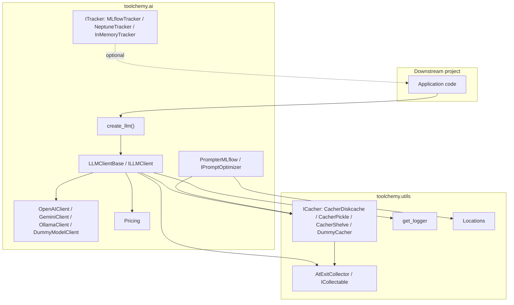

# Explanation

## What toolchemy is for

Toolchemy is a grab-bag library of reusable tooling extracted from several projects, organized around three concerns: talking to model providers (`ai/clients`), tracking experiments and prompts (`ai/trackers`, `ai/prompting`), and general plumbing (`utils`, `db`, `nlp`, `vision`). It's meant to be depended on, not run standalone — the two console scripts (`prompt-studio`, `agent-synergy`) are the only things a consumer runs directly.

## Architecture overview

## Caching is the default, not an add-on

Every `LLMClientBase.completion` / `completion_json` call builds a deterministic cache key from the system prompt, user prompt, model config fingerprint, and any attached images (`_cache_keys_completion`), then checks the cache before doing any network I/O. This is deliberate: LLM calls are slow and billed per-token, so the base class treats "already computed this exact call" as the common case rather than an optimization bolted on afterward.

Consequences of this design:
- `no_cache=True` bypasses caching for one call; `cache_only=True` raises `LLMCacheDoesNotExist` instead of calling the provider if nothing is cached — useful for offline/replay test runs.
- Usage accounting (`usage_summary`) splits cached vs. non-cached requests, so cost estimates reflect only calls that actually hit a provider.
- Swapping cache backends (`CacherDiskcache`, `CacherPickle`, `CacherShelve`, `DummyCacher`) doesn't change client behavior — they all implement `ICacher`, and `create_cache_key` normalizes key construction so backends stay interchangeable.

## Retry and malformed-JSON recovery

Provider calls go through a `tenacity.Retrying` instance (exponential backoff, configurable attempts) so transient provider/network failures don't fail a single call outright. Separately, `completion_json` has its own recovery path: if the provider's response fails to parse as JSON, the client sends the malformed output back to the model with a fix-it prompt template (`_fix_json_prompt_template`) and retries the parse once, before giving up and raising. These are two independent failure modes — network retry vs. output repair — handled at different layers, and both are logged at their point of failure rather than swallowed.

## Why `AtExitCollector` exists

Clients and cachers both implement `ICollectable` (`label()` + `collect()`) and register themselves with `AtExitCollector`, a process-wide, opt-in (`AtExitCollector.enable()`) registry that prints an aggregated usage/cache-hit summary at interpreter exit. It's disabled by default so importing `toolchemy` has no side effects; a consumer opts in explicitly when they want an end-of-run summary (e.g. total LLM spend across every client instantiated during a script).

## `AGENTS_MANIFEST.md` and `agent-synergy`

`toolchemy` ships an auto-generated, introspected manifest of its own public API (`toolchemy/AGENTS_MANIFEST.md`, regenerated by `scripts/generate_agents_manifest.py` via `make docs-agents`) specifically so that AI coding agents working in *downstream* projects can discover reusable symbols without reading source. `agent-synergy` closes the loop: run in a downstream project, it patches that project's `AGENTS.md`/`CLAUDE.md` with a pointer to the manifest's resolved absolute path, so an agent working there is nudged to reuse `toolchemy` helpers (logging, caching, retries, LLM clients, trackers) instead of reimplementing them. This is a deliberate anti-duplication mechanism aimed at agent-assisted development specifically, not human contributors.

## Provider abstraction boundary

`ILLMClient` is intentionally narrow: `completion`, `completion_json`, `embeddings`, `usage`, plus metadata/config accessors. Each provider client (`OpenAIClient`, `GeminiClient`, `OllamaClient`) only needs to implement the low-level `_completion` (return `(text, Usage)`); caching, retry, JSON parsing/repair, and usage tracking all live in `LLMClientBase` and are shared across providers. `create_llm` picks a concrete client from a model name prefix (`gpt*` → OpenAI, `gemini*` → Gemini) or an explicit `uri` for everything else (e.g. local Ollama endpoints), so callers usually don't need to import a provider class directly.
